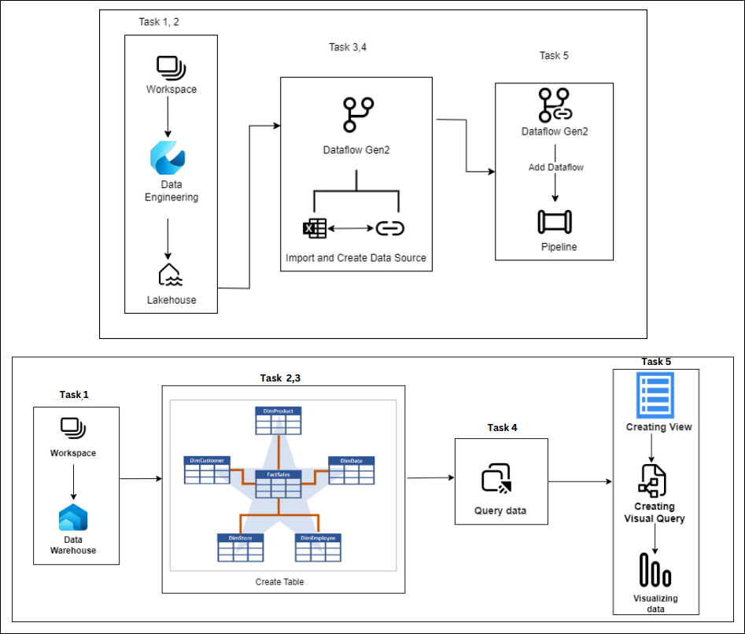
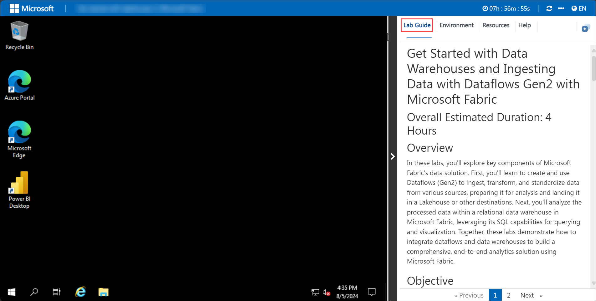
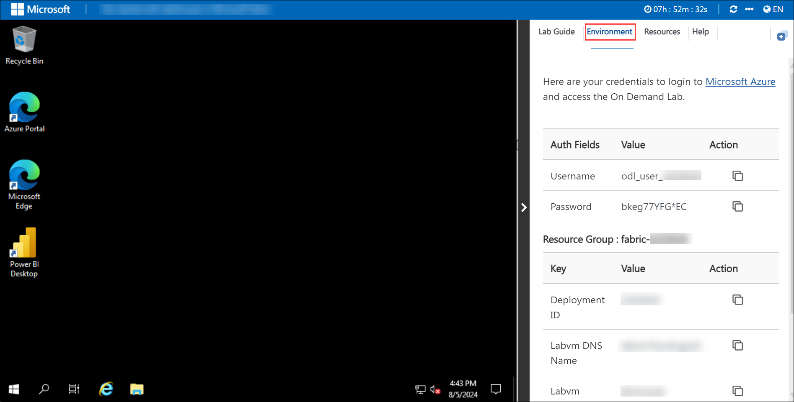
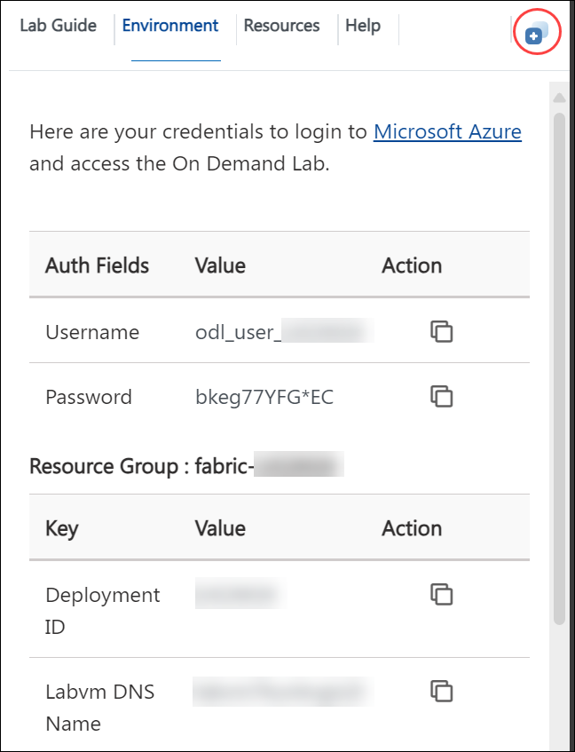
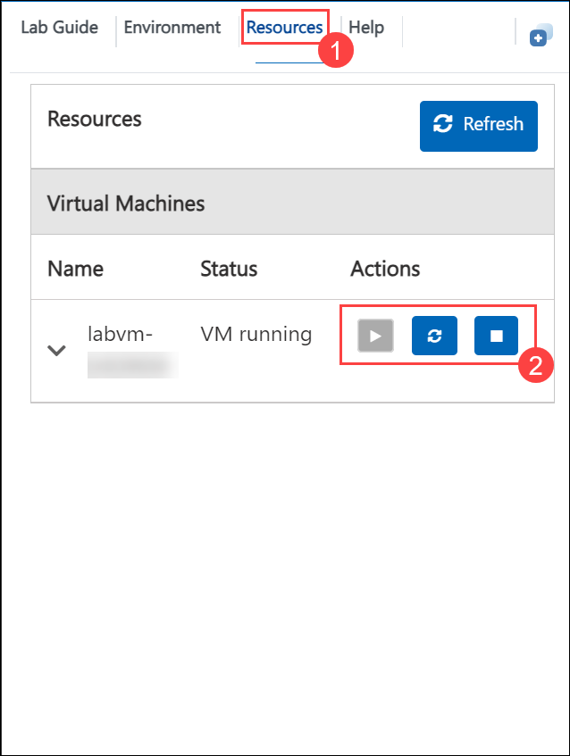

# Get Started with Data Warehouses and Ingesting Data with Dataflows Gen2 with Microsoft Fabric

## Overall Estimated Duration: 4 Hours

## Overview

In this lab, you'll explore key components of Microsoft Fabric's data solution. First, you'll create and use Dataflows (Gen2) to ingest, transform, and standardize data from various sources, preparing it for analysis and landing it in a Lakehouse. Next, you'll analyze the processed data within a relational data warehouse in Microsoft Fabric, leveraging its SQL capabilities for querying and visualization.

## Objective

Explore dataflows, data warehousing, and reporting in Microsoft Fabric. By the end of this lab, You will gain insights on :

- **Create and use a Dataflow (Gen2) in Microsoft Fabric** : Learn to effectively ingest and transform data using Dataflows (Gen2) in Microsoft Fabric. Connect data sources, standardize the data, and efficiently load it to Lakehouse.
- **Analyze data in a Data Warehouse** : Learn to create and manage a relational data warehouse in Microsoft Fabric. Utilize SQL to perform queries and visualizations.

## Pre-requisites

- Fundamental knowledge on Microsoft Fabric
- Basic understanding of Data Analytics

## Architecture

This lab begins with setting up a workspace and a Lakehouse in the Data Engineering area. Next, Dataflows (Gen2) are created to import and configure data sources. These dataflows are then integrated into a pipeline for additional processing. Then  Data Warehouse is created, where tables are created and structured. Following this, data is queried and views are created for further analysis. Finally, visual queries are developed to enable data visualization and provide insights.

## Architecture Diagram

## Explanation of Components

- **Workspace** : Acts as the central hub for organizing and managing data engineering activities in this lab, facilitating the setup and coordination of various components.
- **Lakehouse** : Provides a unified storage solution for raw and processed data, supporting data ingestion and transformation processes crucial for this lab's analytics workflow.
- **Dataflows (Gen2)** : Used to ingest, transform, and standardize data from diverse sources, ensuring clean and consistent data is available for further analysis and reporting in this lab.
- **Data Warehouse** : Serves as the structured storage solution for organizing and analyzing large datasets, enabling efficient querying and reporting for comprehensive data insights in this lab.
- **Pipeline** : Orchestrates the movement and transformation of data, ensuring seamless integration and data flow between different components.
- **Visual Query Tool** :  Enables the creation of visual queries and views, allowing participants to easily analyze and visualize data, and draw actionable insights from the lab's dataset.

## Getting Started with Lab

Once you're ready to dive in, your virtual machine and lab guide will be right at your fingertips within your web browser.
 

### Virtual Machine & Lab Guide
 
Your virtual machine is your workhorse throughout the workshop. The lab guide is your roadmap to success.
 
## Exploring Your Lab Resources
 
To get a better understanding of your lab resources and credentials, navigate to the **Environment Details** tab.
 

 
## Utilizing the Split Window Feature
 
For convenience, you can open the lab guide in a separate window by selecting the **Split Window** button from the top right corner.
 

 
## Managing Your Virtual Machine
 
Feel free to start, stop, or restart your virtual machine as needed from the **Resources** tab. Your experience is in your hands!
 

 
 
 Click "Next" from the bottom right corner to embark on your Lab journey!
 
  
 
Now you're all set to explore the powerful world of technology. Feel free to reach out if you have any questions along the way. Enjoy your workshop!

## Support Contact

The CloudLabs support team is available 24/7, 365 days a year, via email and live chat to ensure seamless assistance at any time. We offer dedicated support channels tailored specifically for both learners and instructors, ensuring that all your needs are promptly and efficiently addressed.

Learner Support Contacts:

- Email Support: labs-support@spektrasystems.com
- Live Chat Support: https://cloudlabs.ai/labs-support

## Happy Learning!!
