# Lab-01 : Create and Ingest Data with a Microsoft Fabric Lakehouse

## Overview

The foundation of Microsoft Fabric is a Lakehouse, which is built on top of the OneLake scalable storage layer and uses Apache Spark and SQL compute engines for big data processing. A 
Lakehouse is a unified platform that combines:

  1. The flexible and scalable storage of a data lake
      
  2. The ability to query and analyze data of a data warehouse

Imagine your company has been using a data warehouse to store structured data from its transactional systems, such as order history, inventory levels, and customer information. You have 
also collected unstructured data from social media, website logs, and third-party sources that are difficult to manage and analyze using the existing data warehouse infrastructure. Your 
company's new directive is to improve its decision-making capabilities by analyzing data in various formats across multiple sources, so the company chooses Microsoft Fabric.

Here, we explore how a lakehouse in Microsoft Fabric can help address scenarios like this by providing a scalable and flexible data store for files and tables that you can query using 
SQL.

### _Architecture Diagram_

   

## Get started with lakehouses in Microsoft Fabric

Large-scale data analytics solutions have traditionally been built around a *data warehouse*, in which data is stored in relational tables and queried using SQL. The growth in "big data" (characterized by high *volumes*, *variety*, and *velocity* of new data assets) together with the availability of low-cost storage and cloud-scale distributed compute technologies has led to an alternative approach to analytical data storage; the *data lake*. In a data lake, data is stored as files without imposing a fixed schema for storage. Increasingly, data engineers and analysts seek to benefit from the best features of both of these approaches by combining them in a *data lakehouse*; in which data is stored in files in a data lake and a relational schema is applied to them as a metadata layer so that they can be queried using traditional SQL semantics.

In Microsoft Fabric, a lakehouse provides highly scalable file storage in a *OneLake* store (built on Azure Data Lake Store Gen2) with a metastore for relational objects such as tables and views based on the open source *Delta Lake* table format. Delta Lake enables you to define a schema of tables in your lakehouse that you can query using SQL.

This lab takes approximately **90** minutes to complete.

> **Note**: You'll need a Microsoft Fabric license to complete this exercise. Complete the previous task to proceed further.

## Task 1 : Create a workspace

Before working with data in Fabric, create a workspace with the Fabric trial enabled.

1. Open the Edge Browser and Sign in to [Microsoft Fabric](https://app.fabric.microsoft.com) at `https://app.fabric.microsoft.com`, enter the following email/username, and then click on **Submit**.  

   * **Username/Email**:  <inject key="AzureAdUserEmail"></inject>

   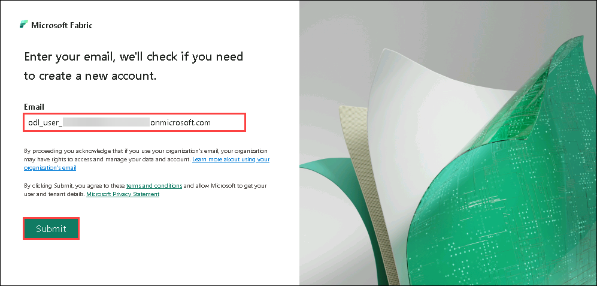

   * **Password:** <inject key="AzureAdUserPassword"></inject>

   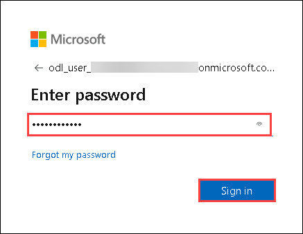

3. From the Microsoft Fabric home page, select **PowerBI**

   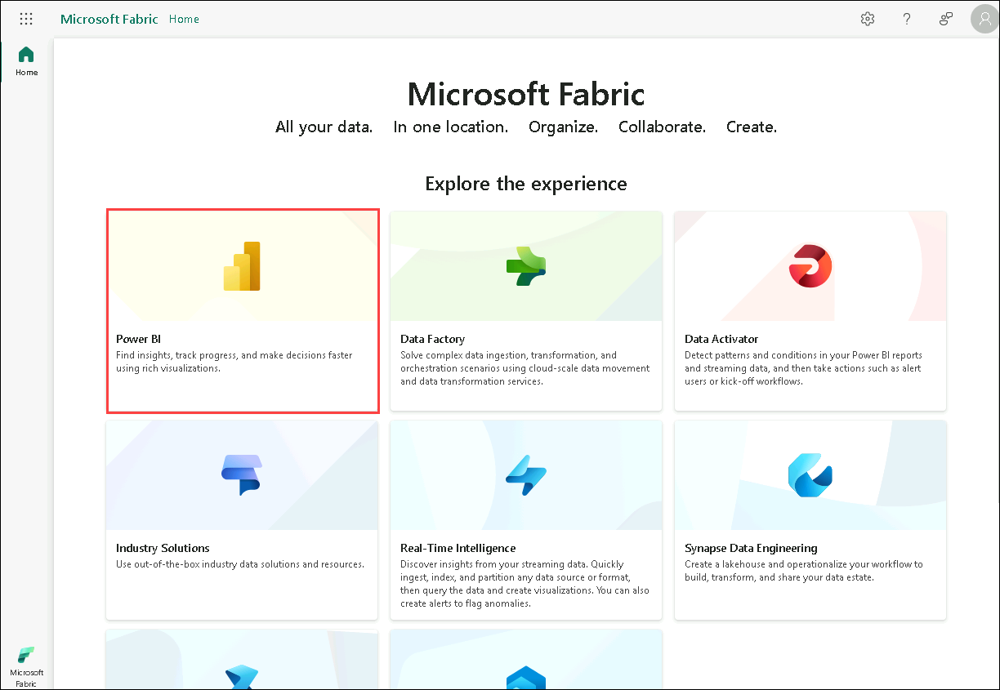
   
4. From the PowerBI home page, select **Account Manager (1)** from the top-right corner to start the **Free trail (2)** of  Microsoft Fabric.

     

5. A new prompt will appear asking you to **Activate your 60-day free Fabric trial capacity**, click on **Activate**.

        
   
6. Once your trial capacity is ready, you receive a confirmation message. Select **Stay on current page** to begin working in Fabric.

    
   
7. Open your **Account manager** again. Notice that you now have a heading for **Trial status**. Your Account manager keeps track of the number of days remaining in your trial.

    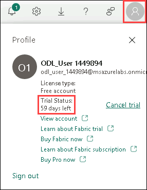

   You now have a **Fabric (Preview) trial** that includes a **Power BI trial** and a **Fabric (Preview) trial capacity**.
     
8. In the menu bar on the left, select **Workspaces** (the icon looks similar to &#128455;). Select **+New Workspace**

   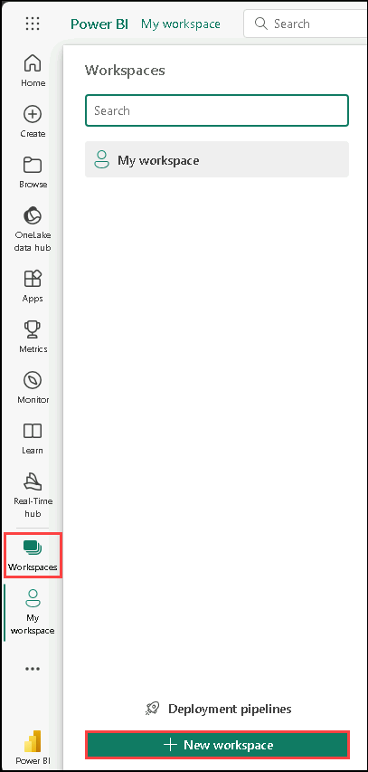

9. Create a new workspace with a name of your choice, select a licensing mode that includes Fabric capacity (*Trial*, *Premium*, or *Fabric*), and click on **Apply**

   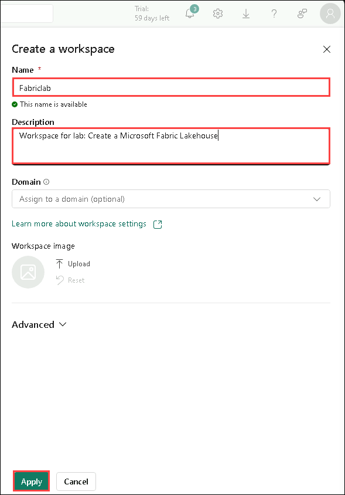

10. When your new workspace opens, it should be empty.

      

   > **Congratulations** on completing the task! Now, it's time to validate it. Here are the steps:
	 - Click the Lab Validation tab located at the upper right corner of the lab guide section and navigate to the Lab Validation tab.
   - Hit the Validate button for the corresponding task. If you receive a success message, you can proceed to the next task. 
   - If you receive a success message, you can proceed to the next task. If not, carefully read the error message and retry the step, following the instructions in the lab guide.
   - If you need any assistance, please contact us at labs-support@spektrasystems.com. We are available 24/7 to help you out.

    <validation step="f77f6f86-fc3c-4fca-a8d2-234693b73ba8" />

## Task 2 : Create a Lakehouse

Now that you have a workspace, it's time to switch to the *Data engineering* experience in the portal and create a data lakehouse for your data files.

1. At the bottom left of the Power BI portal, switch to the **Data Engineering** experience.

    - The data engineering home page includes tiles to create commonly used data engineering assets.

      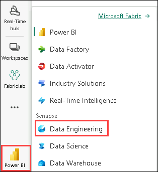
 
2. In the **Data engineering** home page, Select **Lakehouse**

      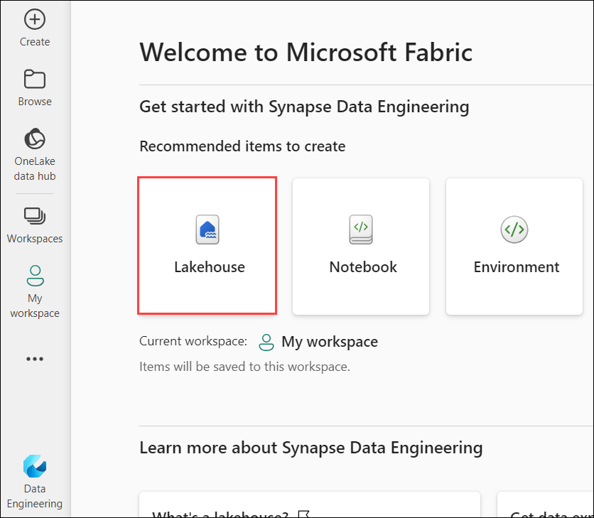

3. Create a new **Lakehouse** with a name of your choice. 

      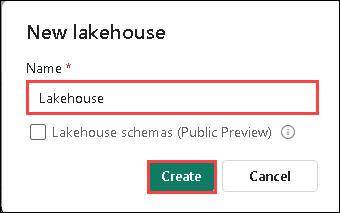

4. After a minute or so, a new lakehouse will be created.

5. View the new lakehouse, and note that the **Lakehouse explorer** pane on the left enables you to browse tables and files in the lakehouse:
    
     - The **Tables** folder contains tables that you can query using SQL semantics. Tables in a Microsoft Fabric lakehouse are based on the open source *Delta Lake* file format, commonly used in Apache Spark.
     - The **Files** folder contains data files in the OneLake storage for the lakehouse that aren't associated with managed delta tables. You can also create *shortcuts* in this folder to reference data that is 
       stored externally.
     - Currently, there are no tables or files in the lakehouse.

       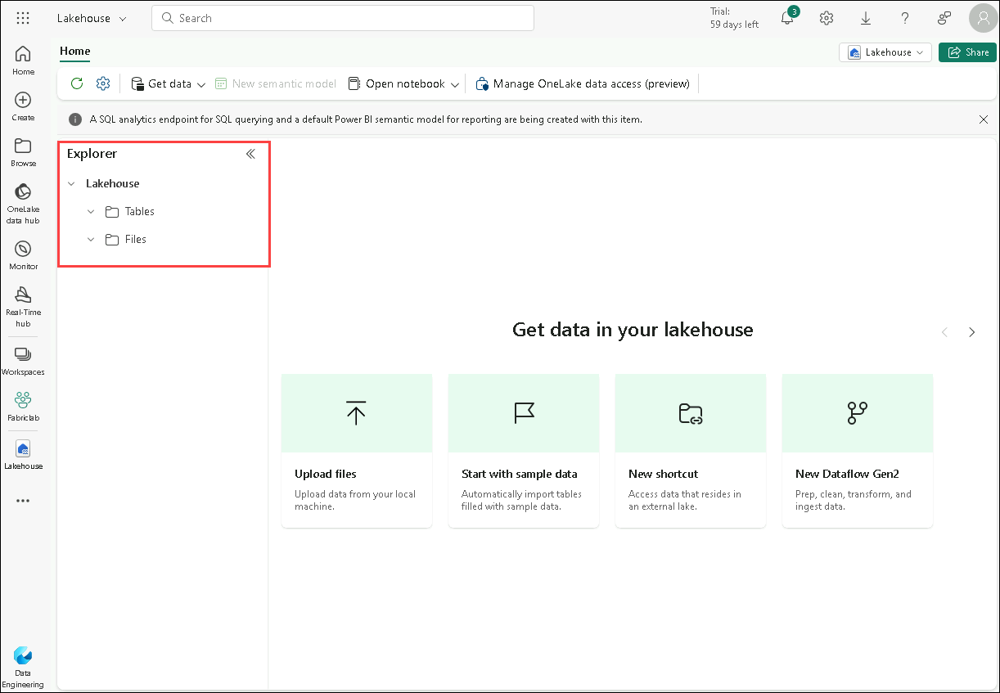
   
## Task 3 : Upload a file

Fabric provides multiple ways to load data into the lakehouse, including built-in support for pipelines that copy data external sources and data flows (Gen 2) that you can define using visual tools based on Power Query. However one of the simplest ways to ingest small amounts of data is to upload files or folders from your local computer (or lab VM if applicable).

1. Download the **sales.csv** file from [https://raw.githubusercontent.com/MicrosoftLearning/dp-data/main/sales.csv](https://raw.githubusercontent.com/MicrosoftLearning/dp-data/main/sales.csv), saving it as 
    **sales.csv** on your local computer (or lab VM if applicable).

    >**Note**: To download the file, open a new tab in the browser and paste it into the URL.
   
    >Right-click anywhere on the page containing the data and select **Save as** to save the page as a CSV file.

      - OR If you are using the lab virtual machine (lab VM) provided to you, you can get the file from the **C:\LabFiles\dp-data-main** directory.

1. Return to the web browser tab containing your lakehouse, and in the **...** menu for the **Files** folder in the **Lakehouse explorer** pane, select **New subfolder**, and create a subfolder named **data**.

      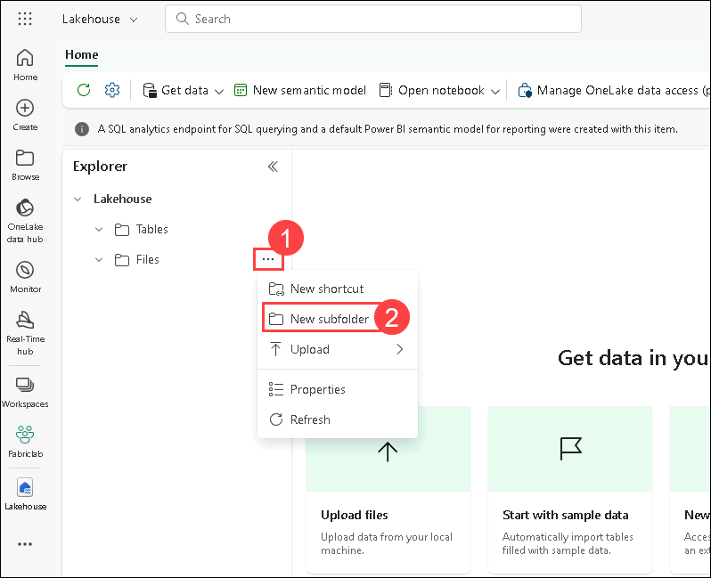
      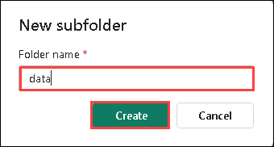

1. In the **...** menu for the new **data** folder, select **Upload** and **Upload files**, and then upload the **sales.csv** file from your local computer (or lab VM if applicable).

      
      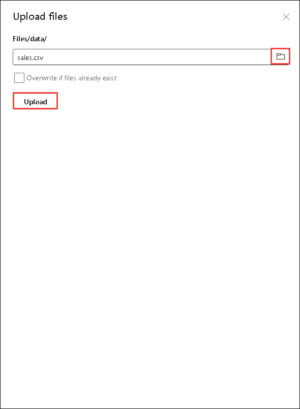
   
1. After the file has been uploaded, select the **Files/data** folder and verify that the **sales.csv** file has been uploaded, as shown here:

      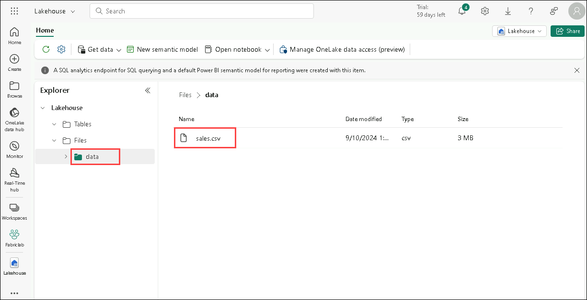

1. Select the **sales.csv** file to see a preview of its contents.

## Task 4 : Explore shortcuts

In many scenarios, the data you need to work with in your lakehouse may be stored in some other location. While there are many ways to ingest data into the OneLake storage for your lakehouse, another option is to instead create a *shortcut*. Shortcuts enable you to include externally sourced data in your analytics solution without the overhead and risk of data inconsistency associated with copying it.

1. In the **...** menu for the **Files** folder, select **New shortcut**.

      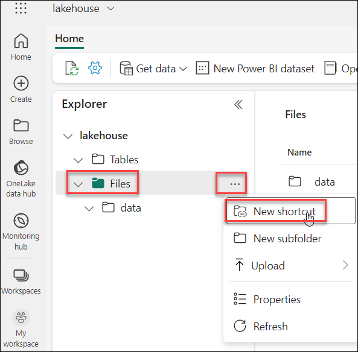

2. View the available data source types for shortcuts. Then close the **New shortcut** dialog box without creating a shortcut.

      

## Task 5 : Load file data into a table

The sales data you uploaded is in a file, which data analysts and engineers can work with directly by using Apache Spark code. However, in many scenarios you may want to load the data from the file into a table so that you can query it using SQL.

1. On the **Home** page, select the **Files/Data** folder so you can see the **sales.csv** file it contains.

2. In the **...** menu for the **sales.csv** file, select **Load to Tables** and click on **New Table**.

      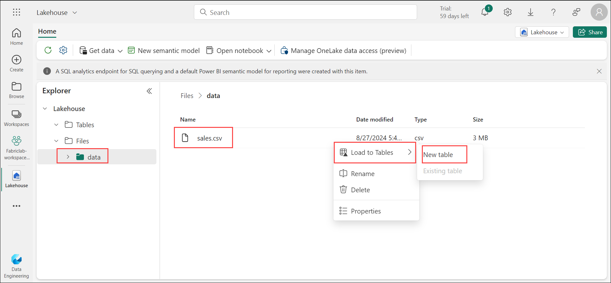
   
3. In the **Load file to new table** dialog box, set the table name to **sales** and confirm the load operation by selecting **Load**. Then wait for the table to be created and loaded.

    >**Tip**: If the **sales** table does not automatically appear, in the **...** menu for the **Tables** folder, select **Refresh**.

   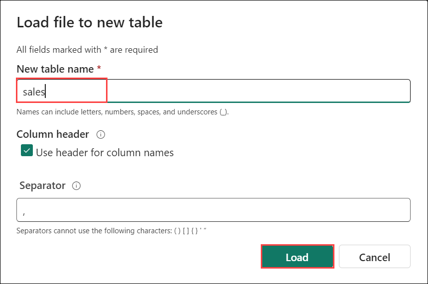
   
4. In the **Lakehouse explorer** pane, select the **sales** table that has been created to view the data.

      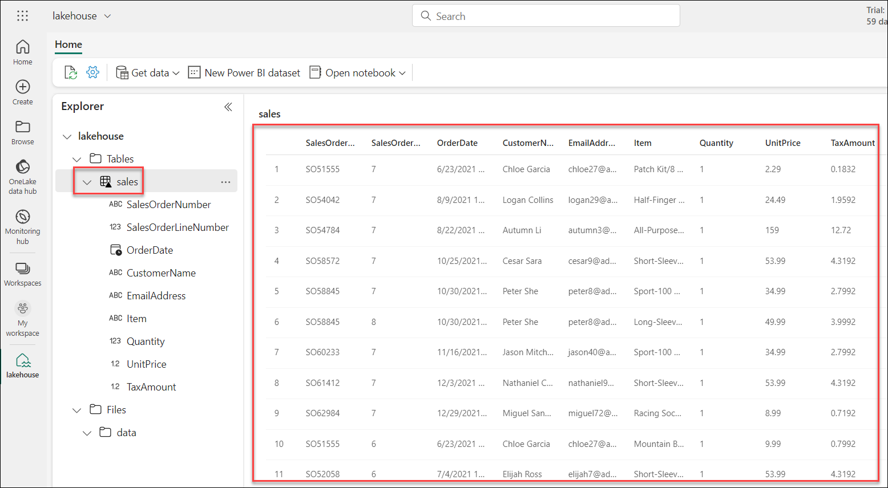

5. In the **...** menu for the **sales** table, select **View files** to see the underlying files for this table

      

   Files for a delta table are stored in *Parquet* format, and include a subfolder named **_delta_log** in which details of transactions applied to the table are logged.

## Task 6 : Use SQL to query tables

When you create a lakehouse and define tables in it, a SQL endpoint is automatically created through which the tables can be queried using SQL `SELECT` statements.

1. At the top-right of the Lakehouse page, switch from **Lakehouse** to **SQL analytics endpoint**. Then wait a short time until the SQL query endpoint for your lakehouse opens in a visual interface from which you can query 
   its tables, as shown here:

      

1. Use the **New SQL query** button to open a new query editor, and enter the following SQL query:

     ```sql
     SELECT Item, SUM(Quantity * UnitPrice) AS Revenue
     FROM sales
     GROUP BY Item
     ORDER BY Revenue DESC;
      ```

      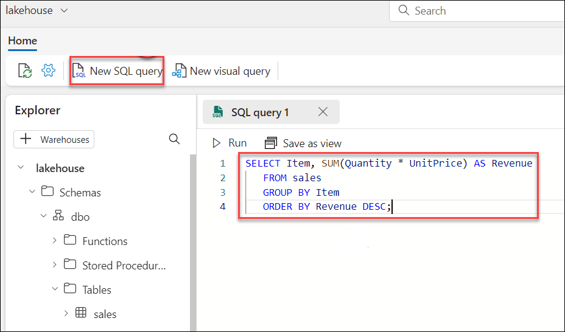

1. Use the **&#9655; Run** button to run the query and view the results, which should show the total revenue for each product.

      

## Task 7 : Create a visual query

While many data professionals are familiar with SQL, data analysts with Power BI experience can apply their Power Query skills to create visual queries.

1. On the toolbar, select **New visual query**.

2. Drag the **sales** table to the new visual query editor pane that opens to create a Power Query as shown here: 

      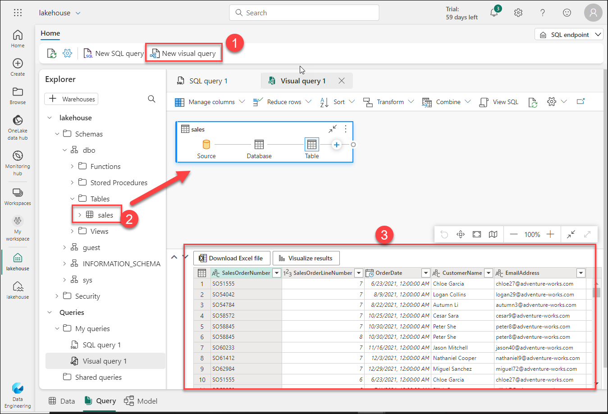

3. In the **Manage columns** menu, select **Choose columns**. Then select only the **SalesOrderNumber** and **SalesOrderLineNumber** columns and click **OK**.

      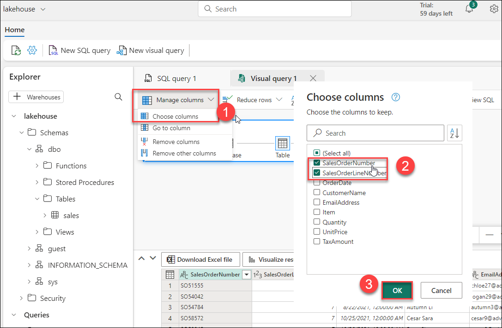

4. In the **Transform** menu, select **Group by**. Then group the data by using the following **Basic** settings:

      - **Group by**: SalesOrderNumber
      - **New column name**: LineItems
      - **Operation**: Count distinct values
      - **Column**: SalesOrderLineNumber

      - When you're done, the results pane under the visual query shows the number of line items for each sales order.

        

## Task 8 : Create a Report

The tables in your lakehouse are automatically added to a default dataset that defines a data model for reporting with Power BI.

1. At the bottom of the SQL Endpoint page, select the **Model** tab. The data model schema for the dataset is shown.

      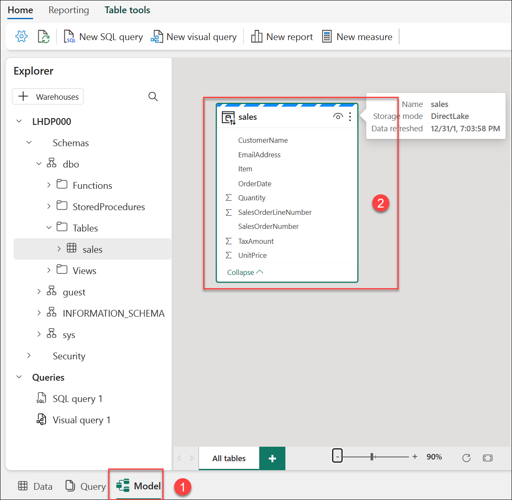

     >**Note**: In this exercise, the data model consists of a single table. In a real-world scenario, you would likely create multiple tables in your lakehouse, each of which would be included in the model. You could then define relationships between these tables in the model.

2. In the menu ribbon, select the **Reporting** tab. Then select **New report**. Click on **Continue**.

      

      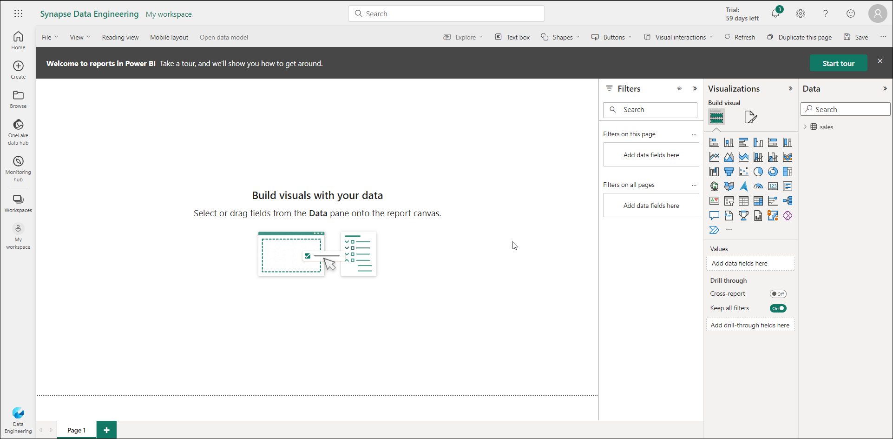

3. In the **Data** pane on the right, expand the **sales** table. Then select the following fields:
    
     - **Item**
     - **Quantity**
     - A table visualization is added to the report:

       

4. Hide the **Data** and **Filters** panes to create more space. Then ensure the table visualization is selected and in the **Visualizations** pane, change the visualization to a **Clustered bar chart** and resize it 
   as shown here.

      

5. On the **File** menu, select **Save**. Then save the report as **Item Sales Report** in the workspace you created previously.

6. Close the browser tab containing the report to return to the SQL endpoint for your lakehouse. Then, in the hub menu bar on the left, select your workspace to verify that it contains the following items:
    
    - Your lakehouse.
    - The SQL analytics endpoint for your lakehouse.
    - A default dataset for the tables in your lakehouse.
    - The **Item Sales Report** report.

      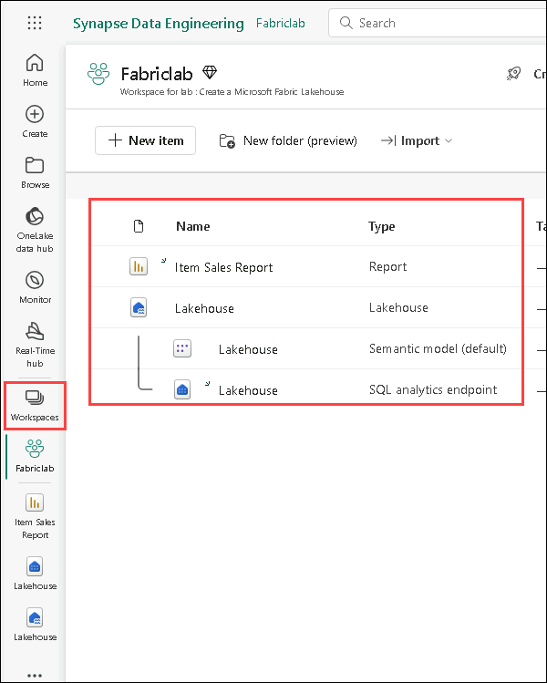

   <validation step="8be3d605-b09f-4738-b1e5-c83a1e304b80" />


   <validation step="d75ef970-6298-404c-aeeb-8dafe17b3ac2" />
   

    >**Congratulations** on completing the task! Now, it's time to validate it. Here are the steps:
    > - Click the Lab Validation tab located at the upper right corner of the lab guide section and navigate to the Lab Validation tab.
    > - Hit the Validate button for the corresponding task.
    > - If you receive a success message, you can proceed to the next task. If not, carefully read the error message and retry the step, following the instructions in the lab guide.
    > - If you need any assistance, please contact us at labs-support@spektrasystems.com. We are available 24/7 to help you out.

## Clean up resources

In this exercise, you have created a lakehouse and imported data into it. You've seen how a lakehouse consists of files and tables stored in a OneLake data store. The managed tables can be queried using SQL, and are included in a default dataset to support data visualizations.

If you've finished exploring your lakehouse, you can delete the workspace you created for this exercise.

1. In the bar on the left, select the icon for your workspace to view all of the items it contains.
2. In the **...** menu on the toolbar, select **Workspace settings**.
3. In the **Other** section, select **Remove this workspace**.
