# Exercise 1 : Create and use a Dataflow (Gen2) in Microsoft Fabric 

## Estimated Duration : 60 Minutes

In this exercise, you will use Dataflows (Gen2) to ingest, transform, and standardize data. You will set up data ingestion processes, apply necessary transformations, and create standardized datasets for analysis. This exercise will help you understand how to efficiently prepare and manage data using Dataflows (Gen2).

## Objectives:
- Task 1 : Create a workspace
- Task 2 : Create a lakehouse
- Task 3 : Create a Dataflow (Gen2) to ingest data
- Task 4 : Add data destination for Dataflow
- Task 5 : Add a dataflow to a pipeline

## Task 1 : Create a workspace

Before working with data in Fabric, create a workspace with the Fabric trial enabled.

1. Sign into [Microsoft Fabric](https://app.fabric.microsoft.com) at `https://app.fabric.microsoft.com`

   * Email/Username: <inject key="AzureAdUserEmail"></inject>

   * Password: <inject key="AzureAdUserPassword"></inject>

   
   
2. After logging in, choose **Power BI**.

   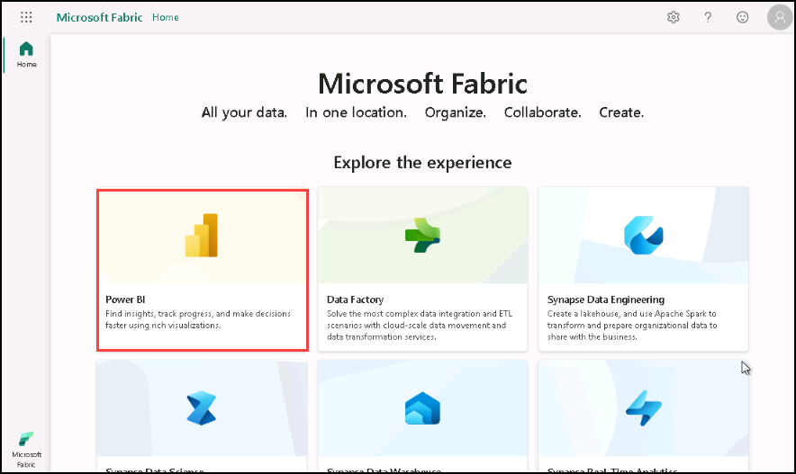

4. From the PowerBI home page, select **Account Manager** from the top-right corner to start the free **Microsoft Fabric trial**. and click on **Free trial**.
    
   
     
5. If prompted, agree to the terms and then select **Activate**. 

   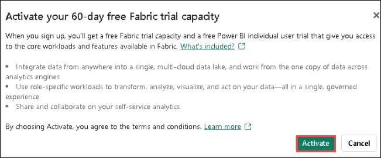
   
6. Once your trial capacity is ready, you receive a confirmation message. Select **Stay on current page** to begin working in Fabric.

   
   
7. On the dashboard, on the top menu you can see **Trial Status 59 days left**.

   

    >**Note**: You now have a **Fabric (Preview) trial** that includes a **Power BI trial** and a **Fabric (Preview) trial capacity**.

8. In the left menu bar, click on **Workspaces (1)**, then select **+ New Workspace (2)**.

   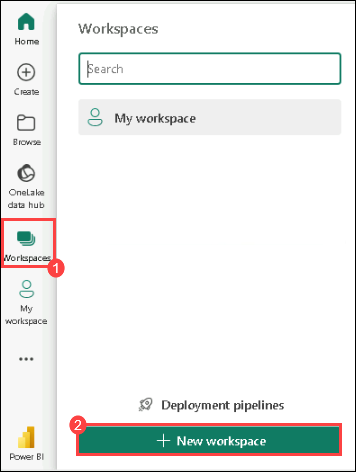

9. Create a new workspace with a name **dp_fabric-<inject key="Deployment ID" enableCopy="false"/> (1)**, Choose a licensing mode as a **trial (2)** under **Advanced**. and click on **Apply (3)**

   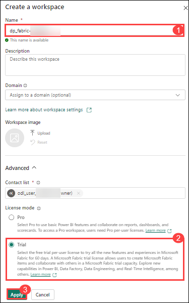
    
10. When your new workspace opens, it should be empty, as shown here:

    

    > **Note**: If the prompt **"Introducing task flows (preview)"** appears, just click on **Got it**.   
 
>**Congratulations** on completing the Task! Now, it's time to validate it. Here are the steps:
> - Hit the Validate button for the corresponding task. If you receive a success message, you have successfully validated the lab. 
> - If not, carefully read the error message and retry the step, following the instructions in the lab guide.
> - If you need any assistance, please contact us at cloudlabs-support@spektrasystems.com.
  
<validation step="61a34bd9-1fc1-47db-b51c-4720f310133d" />

## Task 2 : Create a lakehouse

Now that you have a workspace, it's time to switch to the **Data Engineering** experience in the portal and create a data lakehouse into which you'll ingest data.

1. At the bottom left of the Power BI portal, click the **Power BI (1)** icon to access the **Data Engineering (2)** experience.
   
   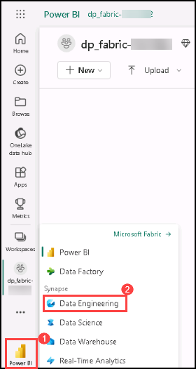
   
2. From the **Data Engineering** homepage, select **Lakehouse**.

   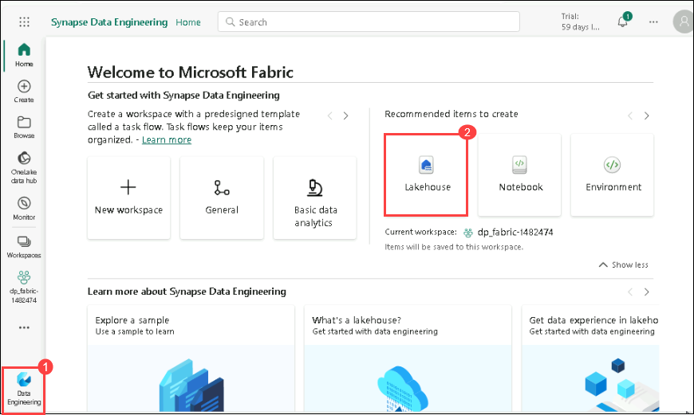

3. Create a new Lakehouse

    Name: Enter **dp_lakehouse**.

>**Congratulations** on completing the Task! Now, it's time to validate it. Here are the steps:
> - Hit the Validate button for the corresponding task. If you receive a success message, you have successfully validated the lab. 
> - If not, carefully read the error message and retry the step, following the instructions in the lab guide.
> - If you need any assistance, please contact us at cloudlabs-support@spektrasystems.com.

<validation step="38c64afd-7502-4783-8169-0e5730914f65" />

## Task 3 : Create a Dataflow (Gen2) to ingest data

Now that you have a lakehouse, you need to ingest some data into it. One way to do this is to define a dataflow that encapsulates an *extract, transform, and load* (ETL) process.

1. Select your workspace, **dp_fabric-<inject key="Deployment ID" enableCopy="false"/>(1)**, then click **+ New item** 

   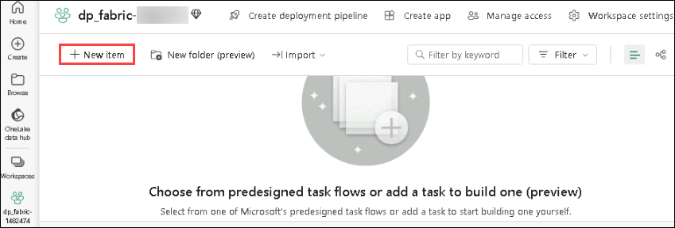
   
2. Search for **Dataflow Gen2** and select it .

   
   
3. After a few seconds, the Power Query editor for your new dataflow opens as shown here.

   

4. Select **Import from a Text/CSV file**, and create a new data source with the following settings:

    - **Link to file**: *Selected*
    - **File path or URL**: `https://raw.githubusercontent.com/MicrosoftLearning/dp-data/main/orders.csv`
    - **Connection**: Create new connection
    - **data gateway**: (none)
    - **Authentication kind**: Anonymous
    - **Privacy level** : none

      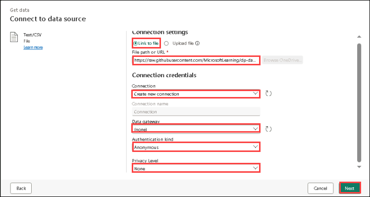
   
5. Select **Next** to preview the file data, and then **Create** the data source. The Power Query editor shows the data source and an initial set of query steps to 
   format the data, as shown here:

   

6. On the toolbar ribbon, select the **Add column** tab. Then select **Custom column**.

   
   
7. Create a new column named **MonthNo** that contains a number based on the formula `Date.Month([OrderDate])` - as shown here and 
   Click on **OK**.

   

8. The step to add the custom column is added to the query and the resulting column is displayed in the data pane:

   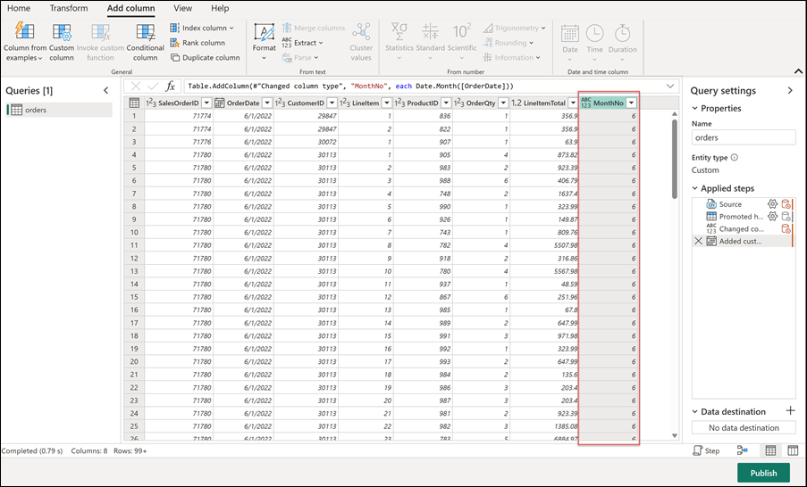

    > **Tip:** In the Query Settings pane on the right side, notice the **Applied Steps** include each transformation step. At the bottom, you can also toggle the 
      **Diagram flow** button to turn on the Visual Diagram of the steps.
    > Steps can be moved up or down, edited by selecting the gear icon, and you can select each step to see the transformations apply in the preview pane.

## Task 4 : Add data destination for Dataflow

1. On the toolbar ribbon, select the **Home** tab. Then in the **Add data destination** drop-down menu, select **Lakehouse**.
   
   > **Note:** If this option is grayed out, you may already have a data destination set. Check the data destination at the bottom of the Query settings pane on the 
     right side of the Power Query editor. If a destination is already set, you can change it using the gear.

   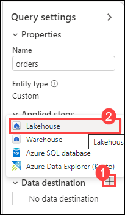

2. In the **Connect to data destination** dialog box, edit the connection and sign in using your Power BI organizational account to set the identity that the dataflow 
   uses to access the lakehouse, Select **Next**.

   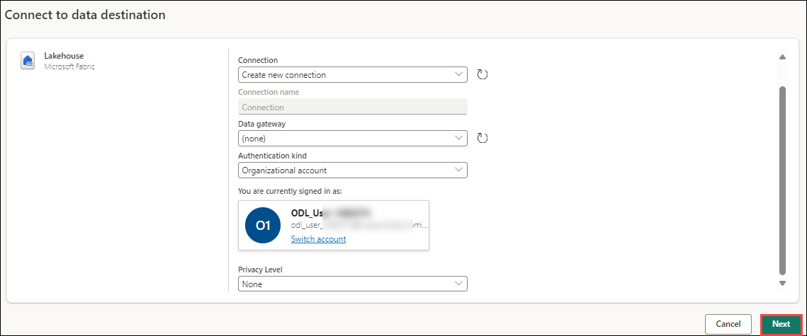

3. In the list of available workspaces, find your workspace and select the lakehouse you created in it at the start of this exercise. Then specify a new table named 
   **orders**:

   

   > **Note:** On the **Destination settings** page, notice how OrderDate and MonthNo are not selected in the Column mapping and there is an informational message: 
     *Change to date/time*.

4. Cancel this action, then go back to OrderDate and MonthNo columns in Power Query online. Right-click on the column header and **Change Type**.

    - OrderDate = Date/Time
    - MonthNo = Whole number

5. Now repeat the process outlined earlier to add a lakehouse destination.

6. On the **Destination settings** page toggle off Use automatic settings, select **Append**, and then save the settings.  

    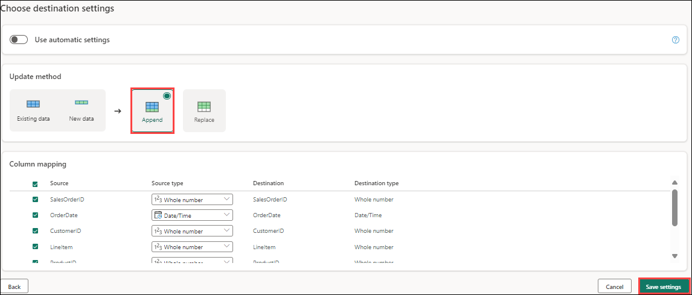

7. The **Lakehouse** destination is indicated as an icon in the query in the Power Query editor.
   
   

   >**Note** : to view the visual query, select the icon from below right corner as shown below :

   >

8. Select **Publish** to publish the dataflow. Then wait for the **Dataflow 1** dataflow to be created in your workspace.

   > **Congratulations** on completing the task! Now, it's time to validate it. Here are the steps
   > - Hit the Validate button for the corresponding task. If you receive a success message, you can proceed to the next task. 
   > - If not, carefully read the error message and retry the step, following the instructions in the lab guide.
   > - If you need any assistance, please contact us at cloudlabs-support@spektrasystems.com. We are available 24/7 to help you out.
    
   <validation step="0957818c-b310-4ba7-9c56-70042c49ede3" />

## Task 5 : Add a dataflow to a pipeline

You can include a dataflow as an activity in a pipeline. Pipelines are used to orchestrate data ingestion and processing activities, enabling you to combine dataflows with other kinds of operation in a single, scheduled process. Pipelines can be created in a few different experiences, including Data Factory experience.

1. In the fabric workspace, ensure you are in the **Data Engineering** experience. Select **Data pipeline**, then create a new pipeline and name it **Load Orders 
   pipeline**.

   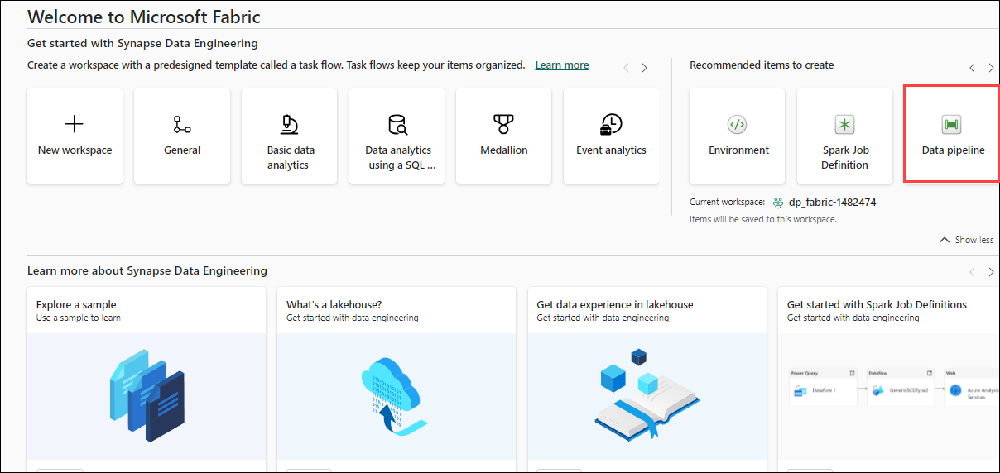

   > **Note**: If the Copy Data wizard opens automatically, close it!

2. Select **Pipeline activity**, and add a **Dataflow** activity to the pipeline.

   

4. With the new **Dataflow1** activity selected, on the **Settings** tab, in the **Dataflow** drop-down list, select **Dataflow 1** (the data flow you created previously)

   

5. On the **Home** tab, save the pipeline using the **&#128427;** (*Save*) icon.

6. Use the **&#9655; Run** button to run the pipeline, and wait for it to complete. It may take a few minutes.

   

8. Navigate back to the lakehouse . In the **ellipses** menu for **Tables**, select **refresh**. Then expand **Tables** and select the **orders** table, which has been 
   created by your dataflow.

   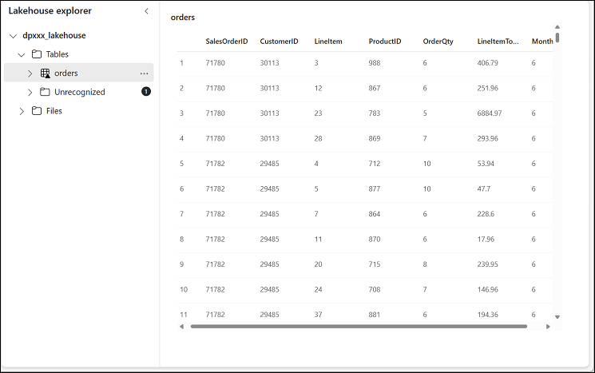

   > **Note**: Use the Power BI Desktop *Dataflows connector* to connect directly to the data transformations done with your dataflow.
   > You can also make additional transformations, publish as a new dataset, and distribute with intended audience for specialized datasets.
     

   > **Congratulations** on completing the task! Now, it's time to validate it. Here are the steps
   > - Hit the Validate button for the corresponding task. If you receive a success message, you can proceed to the next task. 
   > - If not, carefully read the error message and retry the step, following the instructions in the lab guide.
   > - If you need any assistance, please contact us at cloudlabs-support@spektrasystems.com. We are available 24/7 to help you out.

   <validation step="6f702ff3-1450-4b7c-b44f-052a3a77f380" />

## Review

In this lab you have completed the following tasks:

 - Set up a workspace.
 - Create a lakehouse.  
 - Develop a Dataflow (Gen2) for data ingestion and specify a data destination.  
 - Integrate the Dataflow into a pipeline.

### You have successfully completed the lab. To continue, please click on "Next" to proceed to the next lab.
