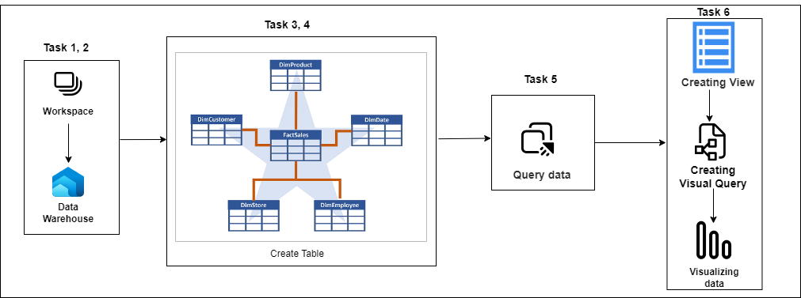
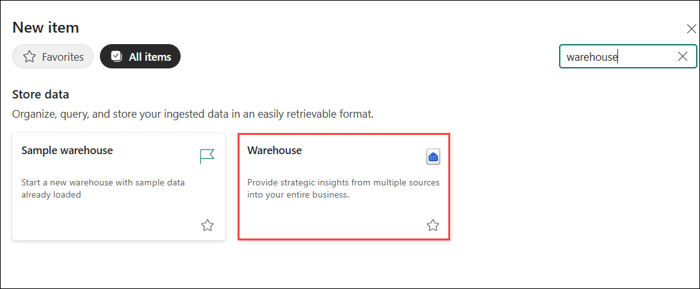
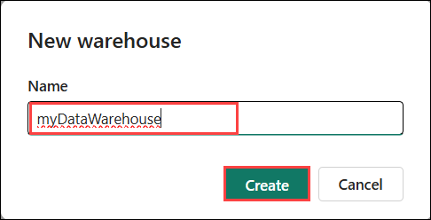
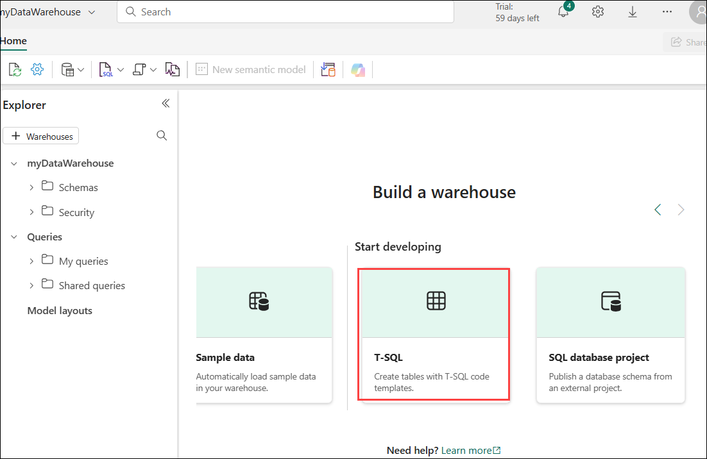
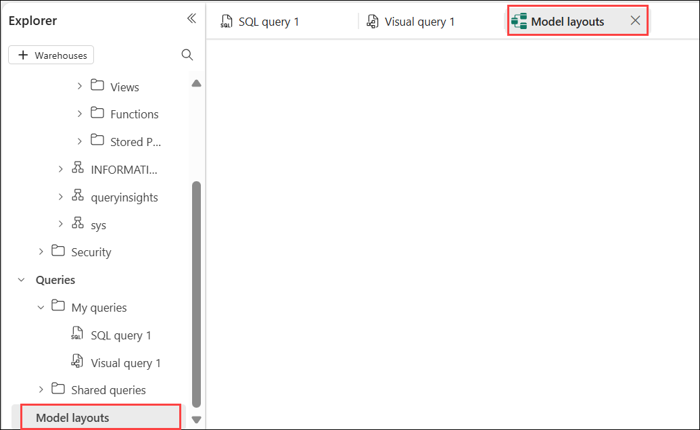
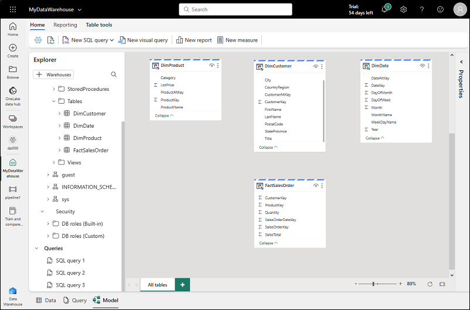
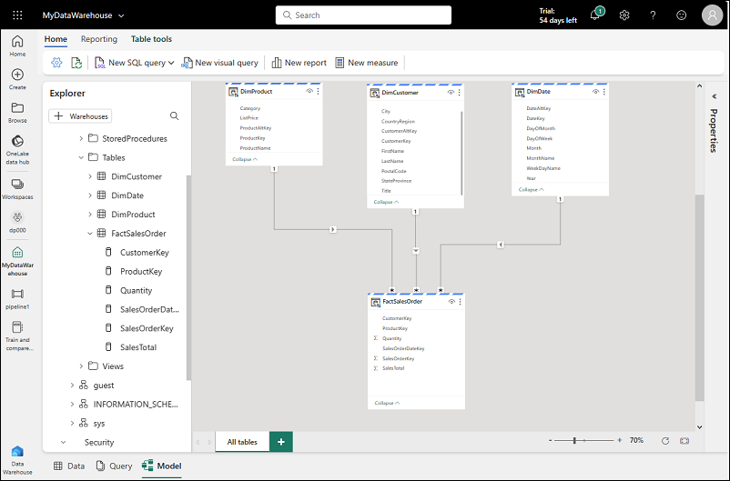
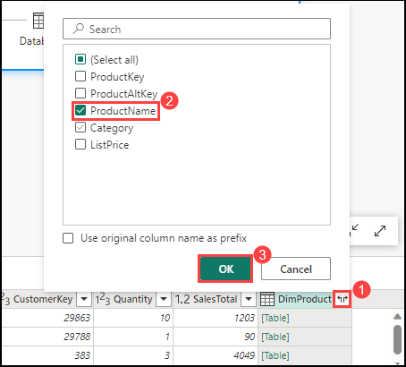

# Lab-02 : Analyze data in a Data Warehouse

## Overview

Data warehouses are analytical stores built on a relational schema to support SQL queries. Microsoft Fabric enables you to create a relational data warehouse in your workspace and 
integrate it easily with other elements of your end-to-end analytics solution.

Microsoft Fabric's data warehouse is a modern version of the traditional data warehouse. It centralizes and organizes data from different departments, systems, and databases into a 
single, unified view for analysis and reporting purposes. Fabric's data warehouse provides full SQL semantics, including the ability to insert, update, and delete data in the tables. 
Fabric's data warehouse is unique because it's built on the Lakehouse, which is stored in Delta format and can be queried using SQL. It's designed for use by the whole data team, not 
just data engineers.

Here, you'll learn about data warehouses in Fabric, create a data warehouse, load, query, and visualize data, and describe datasets.

## _Architecture Diagram_

   

## Get started with data warehouses in Microsoft Fabric

In Microsoft Fabric, a data warehouse provides a relational database for large-scale analytics. Unlike the default read-only SQL endpoint for tables defined in a lakehouse, a data warehouse provides full SQL semantics; including the ability to insert, update, and delete data in the tables.

This lab will take approximately **30** minutes to complete.

> **Note**: You'll need a Microsoft Fabric license to complete this exercise. Complete the previous task to proceed further.

## Task 1 : Create a Data Warehouse

Now that you have a workspace, it's time to create a data warehouse.

1. Choose the workspace **fabriclab_<inject key="DeploymentID" enableCopy="false"/>**

1. Click on **+New Item** from the workspace.

      

1. Search for **warehouse** and select it .

      
    
1. Name it as **myDataWarehouse** and click on **Create**.

    After a minute or so, a new warehouse will be created:

    

## Task 3 : Create tables and insert data

A warehouse is a relational database in which you can define tables and other objects.

1. In your new warehouse, select the **Create tables with T-SQL** tile, and replace the default SQL code with the following CREATE TABLE statement:

    

    ```sql
   CREATE TABLE dbo.DimProduct
   (
       ProductKey INTEGER NOT NULL,
       ProductAltKey VARCHAR(25) NULL,
       ProductName VARCHAR(50) NOT NULL,
       Category VARCHAR(50) NULL,
       ListPrice DECIMAL(5,2) NULL
   );
   GO
    ```

2. Use the **&#9655; Run** button to run the SQL script, which creates a new table named **DimProduct** in the **dbo** schema of the data warehouse.

3. Use the **Refresh** button on the toolbar to refresh the view. Then, in the **Explorer** pane, expand **Schemas** > **dbo** > **Tables** and verify that the **DimProduct** table has been created.

4. On the **Home** menu tab, use the **New SQL Query** button to create a new query, and enter the following INSERT statement:

    ```sql
   INSERT INTO dbo.DimProduct
   VALUES
   (1, 'RING1', 'Bicycle bell', 'Accessories', 5.99),
   (2, 'BRITE1', 'Front light', 'Accessories', 15.49),
   (3, 'BRITE2', 'Rear light', 'Accessories', 15.49);
   GO
    ```

5. Run the new query to insert three rows into the **DimProduct** table.

6. When the query has finished, select the **Data** tab at the bottom of the page in the data warehouse. In the **Explorer** pane, select the **DimProduct** table and verify that the three rows have been added to the table.

7. On the **Home** menu tab, use the **New SQL Query** button to create a new query. Then copy and paste the Transact-SQL code from [https://raw.githubusercontent.com/MicrosoftLearning/dp-data/main/create-dw.txt](https://raw.githubusercontent.com/MicrosoftLearning/dp-data/main/create-dw.txt) into the new query pane.

<!-- I had to remove the GO command in this query as well -->

8. Run the query, which creates a simple data warehouse schema and loads some data. The script should take around 30 seconds to run.

9. Use the **Refresh** button on the toolbar to refresh the view. Then in the **Explorer** pane, verify that the **dbo** schema in the data warehouse now contains the following four tables:
    - **DimCustomer**
    - **DimDate**
    - **DimProduct**
    - **FactSalesOrder**

    > **Tip**: If the schema takes a while to load, just refresh the browser page.

## Task 4 : Define a Data Model

A relational data warehouse typically consists of *fact* and *dimension* tables. The fact tables contain numeric measures you can aggregate to analyze business performance (for example, sales revenue), and the dimension tables contain attributes of the entities by which you can aggregate the data (for example, product, customer, or time). In a Microsoft Fabric data warehouse, you can use these keys to define a data model that encapsulates the relationships between the tables.

1. At the bottom of the page , select the **Model** tab.
   
   


2. In the model pane, rearrange the tables in your data warehouse so that the **FactSalesOrder** table is in the middle, like this:

    

3. Drag the **ProductKey** field from the **FactSalesOrder** table and drop it on the **ProductKey** field in the **DimProduct** table. Then confirm the following relationship details:
    - **Table 1**: FactSalesOrder
    - **Column**: ProductKey
    - **Table 2**: DimProduct
    - **Column**: ProductKey
    - **Cardinality**: Many to one (*:1)
    - **Cross filter direction**: Single
    - **Make this relationship active**: Selected
    - **Assume referential integrity**: Unselected

4. Repeat the process to create many-to-one relationships between the following tables:
    - **FactOrderSales.CustomerKey** &#8594; **DimCustomer.CustomerKey**
    - **FactOrderSales.SalesOrderDateKey** &#8594; **DimDate.DateKey**

    When all of the relationships have been defined, the model should look like this:

    

## Task 5 : Query data Warehouse tables

Since the data warehouse is a relational database, you can use SQL to query its tables.

### Query fact and dimension tables

Most queries in a relational data warehouse involve aggregating and grouping data (using aggregate functions and GROUP BY clauses) across related tables (using JOIN clauses).

1. Create a new SQL Query, and run the following code:

    ```sql
   SELECT  d.[Year] AS CalendarYear,
            d.[Month] AS MonthOfYear,
            d.MonthName AS MonthName,
           SUM(so.SalesTotal) AS SalesRevenue
   FROM FactSalesOrder AS so
   JOIN DimDate AS d ON so.SalesOrderDateKey = d.DateKey
   GROUP BY d.[Year], d.[Month], d.MonthName
   ORDER BY CalendarYear, MonthOfYear;
    ```

    Note that the attributes in the time dimension enable you to aggregate the measures in the fact table at multiple hierarchical levels - in this case, year and month. This is a common pattern in data warehouses.

2. Modify the query as follows to add a second dimension to the aggregation.

    ```sql
   SELECT  d.[Year] AS CalendarYear,
           d.[Month] AS MonthOfYear,
           d.MonthName AS MonthName,
           c.CountryRegion AS SalesRegion,
          SUM(so.SalesTotal) AS SalesRevenue
   FROM FactSalesOrder AS so
   JOIN DimDate AS d ON so.SalesOrderDateKey = d.DateKey
   JOIN DimCustomer AS c ON so.CustomerKey = c.CustomerKey
   GROUP BY d.[Year], d.[Month], d.MonthName, c.CountryRegion
   ORDER BY CalendarYear, MonthOfYear, SalesRegion;
    ```

3. Run the modified query and review the results, which now include sales revenue aggregated by year, month, and sales region.

## Task 6 : Create a View

A data warehouse in Microsoft Fabric has many of the same capabilities you may be used to in relational databases. For example, you can create database objects like *views* and *stored procedures* to encapsulate SQL logic.

1. Modify the query you created previously as follows to create a view (note that you need to remove the ORDER BY clause to create a view).

    ```sql
   CREATE VIEW vSalesByRegion
   AS
   SELECT  d.[Year] AS CalendarYear,
           d.[Month] AS MonthOfYear,
           d.MonthName AS MonthName,
           c.CountryRegion AS SalesRegion,
          SUM(so.SalesTotal) AS SalesRevenue
   FROM FactSalesOrder AS so
   JOIN DimDate AS d ON so.SalesOrderDateKey = d.DateKey
   JOIN DimCustomer AS c ON so.CustomerKey = c.CustomerKey
   GROUP BY d.[Year], d.[Month], d.MonthName, c.CountryRegion;
    ```

2. Run the query to create the view. Then refresh the data warehouse schema and verify that the new view is listed in the **Explorer** pane.

3. Create a new SQL query and run the following SELECT statement:

    ```SQL
   SELECT CalendarYear, MonthName, SalesRegion, SalesRevenue
   FROM vSalesByRegion
   ORDER BY CalendarYear, MonthOfYear, SalesRegion;
    ```

### Create a visual query

Instead of writing SQL code, you can use the graphical query designer to query the tables in your data warehouse. This experience is similar to Power Query online, where you can create data transformation steps with no code. For more complex tasks, you can use Power Query's M (Mashup) language.

1. On the **Home** menu, select **New visual query**.

2. Drag **FactSalesOrder** onto the **canvas**. Notice that a preview of the table is displayed in the **Preview** pane below.

3. Drag **DimProduct** onto the **canvas**. We now have two tables in our query.

4. Use the **(+)** button on the **FactSalesOrder** table on the canvas to **Merge queries**.

    

5. In the **Merge queries** window, select **DimProduct** as the right table for merge. Select **ProductKey** in both queries, leave the default **Left outer** join type, and click **OK**.

6. In the **Preview**, note that the new **DimProduct** column has been added to the FactSalesOrder table. Expand the column by clicking the arrow to the right of the column name. Select **ProductName** and click **OK**.

    

7. If you're interested in looking at data for a single product, per a manager request, you can now use the **ProductName** column to filter the data in the query. Filter the **ProductName** column to look at **Cable Lock** data only.

8. From here, you can analyze the results of this single query by selecting **Visualize results** or **Open in Excel**. You can now see exactly what the manager was asking for, so we don't need to analyze the results further.

### Visualize your data

You can easily visualize the data in either a single query, or in your data warehouse. Before you visualize, hide columns and/or tables that aren't friendly to report designers.

1. In the **Explorer** pane, select the **Model** view. 

2. Hide the following columns in your Fact and Dimension tables that are not necessary to create a report. Note that this does not remove the columns from the model, it simply hides them from view on the report canvas.
   1. FactSalesOrder
      - **SalesOrderDateKey**
      - **CustomerKey**
      - **ProductKey**
   1. DimCustomer
      - **CustomerKey**
      - **CustomerAltKey**
   1. DimDate
      - **DateKey**
      - **DateAltKey**
   1. DimProduct
      - **ProductKey**
      - **ProductAltKey** 

   

3. Now you're ready to build a report and make this dataset available to others. On the Home menu, select **New report**. This will open a new window, where you can create a Power BI report.

4. In the **Data** pane, expand **FactSalesOrder**. Note that the columns you hid are no longer visible. 

5. Select **SalesTotal**. This will add the column to the **Report canvas**. Because the column is a numeric value, the default visual is a **column chart**.

6. Ensure that the column chart on the canvas is active (with a gray border and handles), and then select **Category** from the **DimProduct** table to add a category to your column chart.

7. In the **Visualizations** pane, change the chart type from a column chart to a **clustered bar chart**. Then resize the chart as necessary to ensure that the categories are readable.

    

8. In the **Visualizations** pane, select the **Format your visual** tab and in the **General** sub-tab, in the **Title** section, change the **Text** to **Total Sales by Category**.

9. In the **File** menu, select **Save**. Then save the report as **Sales Report** in the workspace you created previously.

10. In the menu hub on the left, navigate back to the workspace. Notice that you now have three items saved in your workspace: your data warehouse, its default dataset, and the report you created.

    

## Clean up resources

In this exercise, you have created a data warehouse that contains multiple tables. You used SQL to insert data into the tables and query them. and also used the visual query tool. Finally, you enhanced the data model for the data warehouse's default dataset and used it as the source for a report.

If you've finished exploring your data warehouse, you can delete the workspace you created for this exercise.

1. In the bar on the left, select the icon for your workspace to view all of the items it contains.
2. In the **...** menu on the toolbar, select **Workspace settings**.
3. In the **Other** section, select **Remove this workspace**.
