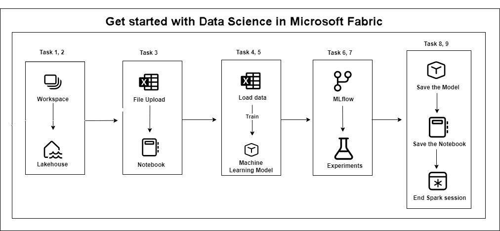
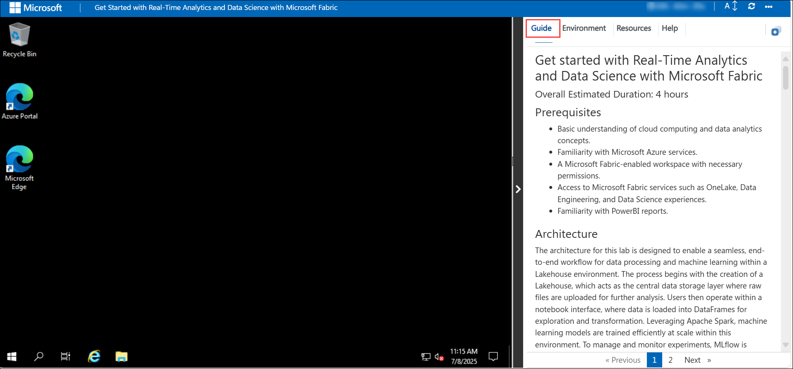
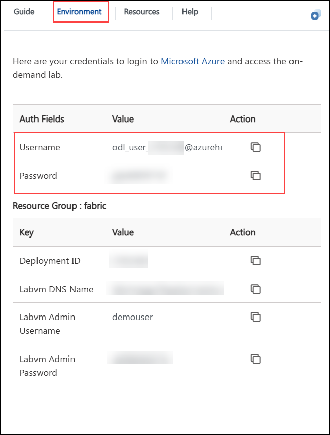
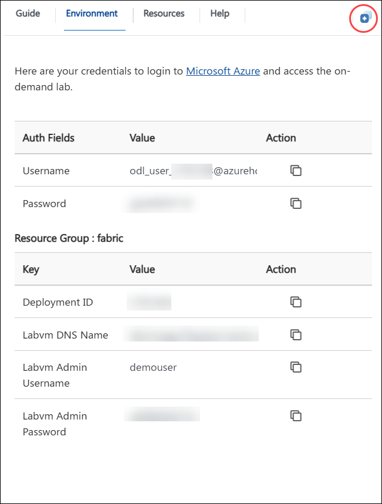
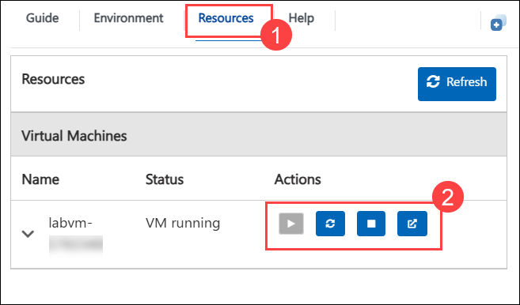
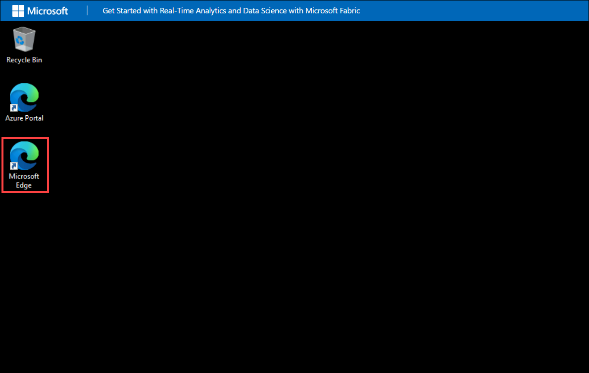
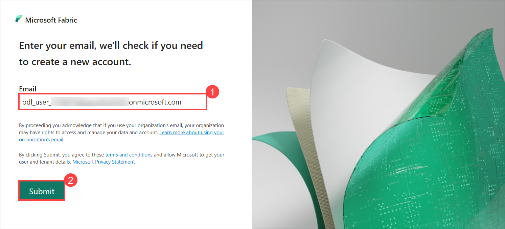
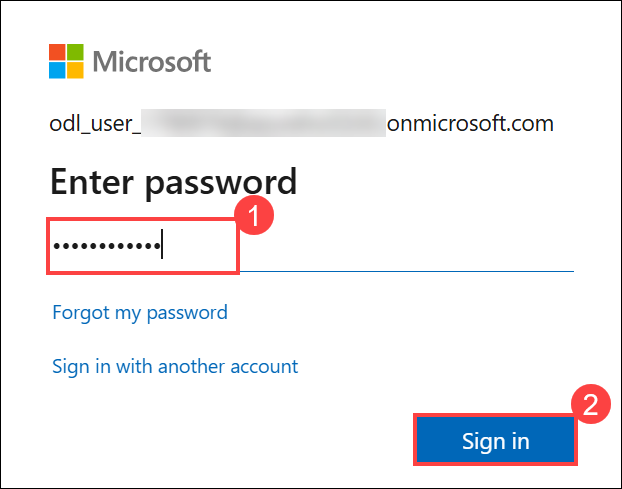
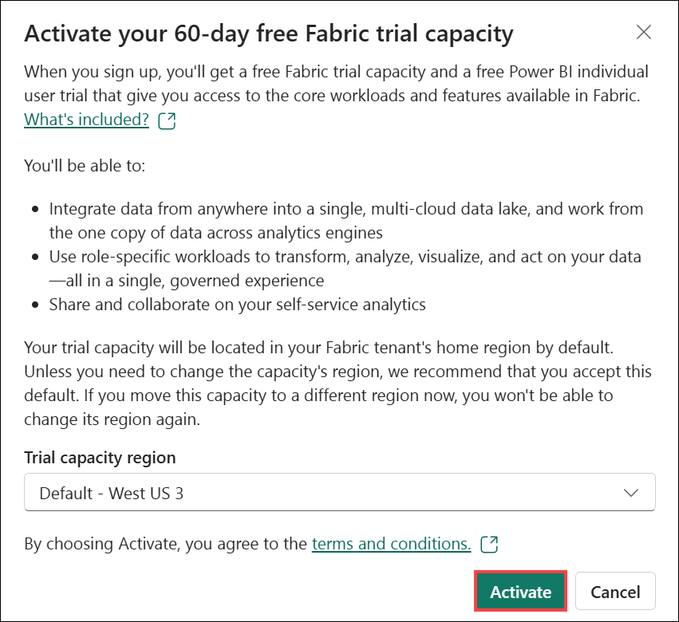
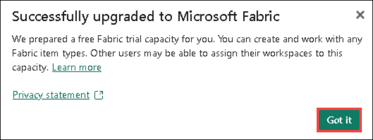

# Get Started with Real-Time Analytics and Data Science with Microsoft Fabric

### Overall Estimated Duration: 4 Hours

## Overview

This lab provides a comprehensive, hands-on walkthrough of building an end-to-end data science pipeline using Microsoft Fabric. You'll start by setting up your workspace and Lakehouse, uploading and exploring data, and then transition into interactive development using Notebooks. You'll train machine learning models, track experiments using MLflow, and finally, save your models for future use. By the end of this lab, you'll have a complete understanding of how to leverage Microsoft Fabric to streamline the data science lifecycle from data ingestion to model management.

## Objective

- Set up the Microsoft Fabric environment by activating the trial, creating a workspace, and configuring a Lakehouse with uploaded data.

- Create and use a Notebook to explore the churn dataset, preprocess it using DataFrames, and train machine learning models using Scikit-learn.

- Track and manage experiments with MLflow by comparing model runs, reviewing metrics, and visualizing model performance.

- Save the trained model and Notebook, end the Spark session, and clean up the workspace after completing the lab.

## Prerequisites

- Basic understanding of cloud computing and data analytics concepts.  
- Familiarity with Microsoft Azure services.  
- A Microsoft Fabric-enabled workspace with necessary permissions.  
- Access to Microsoft Fabric services such as OneLake, Data Engineering, and Data Science experiences.  

## Architecture

The architecture for this lab is designed to enable a seamless, end-to-end workflow for data processing and machine learning within a Lakehouse environment. The process begins with the creation of a Lakehouse, which acts as the central data storage layer where raw files are uploaded for further analysis. Users then operate within a notebook interface, where data is loaded into DataFrames for exploration and transformation. Leveraging Apache Spark, machine learning models are trained efficiently at scale within this environment. To manage and monitor experiments, MLflow is integrated into the architecture, allowing users to track, compare, and analyze multiple model runs. Once a model is finalized, it is saved for future use, and the notebook is persisted as part of the workflow. Finally, the Spark session is properly terminated to optimize resource usage. This architecture supports a structured, scalable, and reproducible pipeline from data ingestion to model training and experiment tracking, ensuring clarity and control at every stage of the lab.

## Architecture Diagram



## Explanation of Components

The architecture for this lab involves several key components:

- **Workspace:** A centralized environment for managing resources, projects, and collaboration.
- **Lakehouse:** A unified storage solution combining data lakes and warehouses for scalable analytics.
- **Notebook:** An interactive document for writing, executing, and visualizing code, commonly used in data science and engineering.
- **Machine Learning Model:** The trained output of your data and algorithm, used to make predictions on new inputs.
- **MLflow:** An open source platform integrated into Microsoft Fabric for managing the ML lifecycle: tracking experiments, parameters, metrics, and models.

## Getting Started with the Lab

Welcome to Real-Time Analytics and Data Science with Microsoft Fabric Workshop! We've prepared a seamless environment for you to explore and learn about fabric services. Let's begin by making the most of this experience.

## Accessing Your Lab Environment

Once you're ready to dive in, your virtual machine and **Guide** will be right at your fingertips within your web browser.
 


## Virtual Machine & Lab Guide

Your virtual machine is your workhorse throughout the workshop. The lab guide is your roadmap to success.

## Exploring Your Lab Resources
 
To get a better understanding of your lab resources and credentials, navigate to the **Environment** Details tab.
 

 
## Utilizing the Split Window Feature
 
For convenience, you can open the guide in a separate window by selecting the **Split Window** button from the top right corner.
 

 
## Managing Your Virtual Machine
 
Feel free to **start, stop, or restart (2)** your virtual machine as needed from the **Resources** **(1)** tab. Your experience is in your hands!
 

 
## Lab Guide Zoom In/Zoom Out
 
To adjust the zoom level for the environment page, click the **A↕ : 100%** icon located next to the timer in the lab environment.

 

## Login to the Azure Portal

1. On your virtual machine, click on the **Microsoft Edge** icon as shown below:
 
   

1. In the new tab, navigate to the **Microsoft Fabric** portal by copying and pasting the following URL into the address bar.

   ```
   https://app.fabric.microsoft.com
   ```
   
1. On the **Enter your email, we’ll check if you need to create a new account.** tab, you will see the login screen. In that enter the following email/username **(1)** and click **Submit (2)**:

   - **Email/Username:** <inject key="AzureAdUserEmail"></inject>
 
       
 
1. Next, provide your password **(1)** and click on **Sign in (2)**
 
   - **Password:** <inject key="AzureAdUserPassword"></inject>
 
       

1. If you see the pop-up **Stay Signed in?**, select **No**.

   

1. On the Microsoft Fabric portal, select the **Account manager** icon at the top-right corner **(1)** of the portal. In the profile pane that appears, click on **Free trial** **(2)** to begin activating your Microsoft Fabric trial.

   

1. On the **Activate your 60-day free Fabric trial capacity** page, click **Activate** to start your trial.

   

   >**Note:** The trial capacity region may differ from the one shown in the screenshot. No need to worry – simply use the default selected region, activate it, and continue to the next step.

1. If you see a pop-up message saying "Successfully upgraded to Microsoft Fabric", click **Got it**.

   

## References:
- [Microsoft Learn](https://learn.microsoft.com)
- [Microsoft Fabric Documentation](https://learn.microsoft.com/en-us/fabric/)
- [Azure Machine Learning Documentation](https://learn.microsoft.com/en-us/azure/machine-learning/)
   
### Support Contact
The CloudLabs support team is available 24/7, 365 days a year, via email and live chat to ensure seamless assistance at any time. We offer dedicated support channels tailored specifically for both learners and instructors, ensuring that all your needs are promptly and efficiently addressed.
 
Learner Support Contacts:
 
- Email Support: cloudlabs-support@spektrasystems.com
- Live Chat Support: https://cloudlabs.ai/labs-support

Now you're all set to explore the powerful world of technology. Feel free to reach out if you have any questions along the way. Enjoy your workshop!

Now, click on **Next >>** from the lower right corner to move on to the next page.

  
 
### Happy learning!
